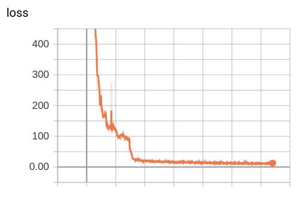
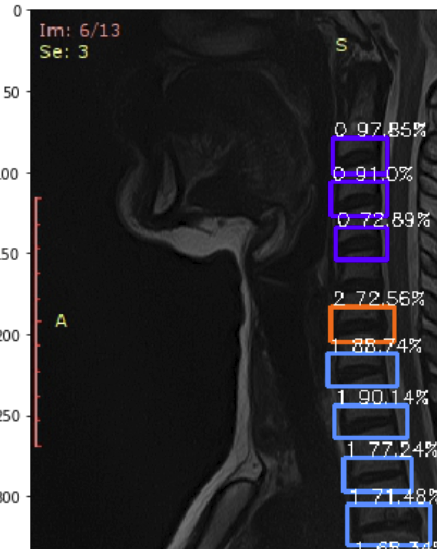
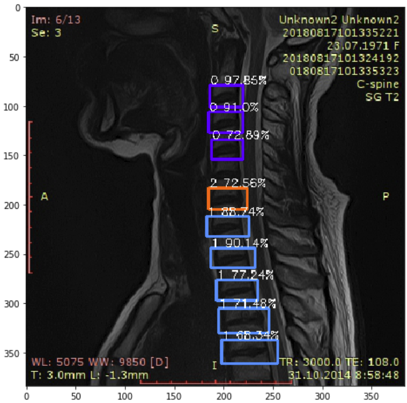
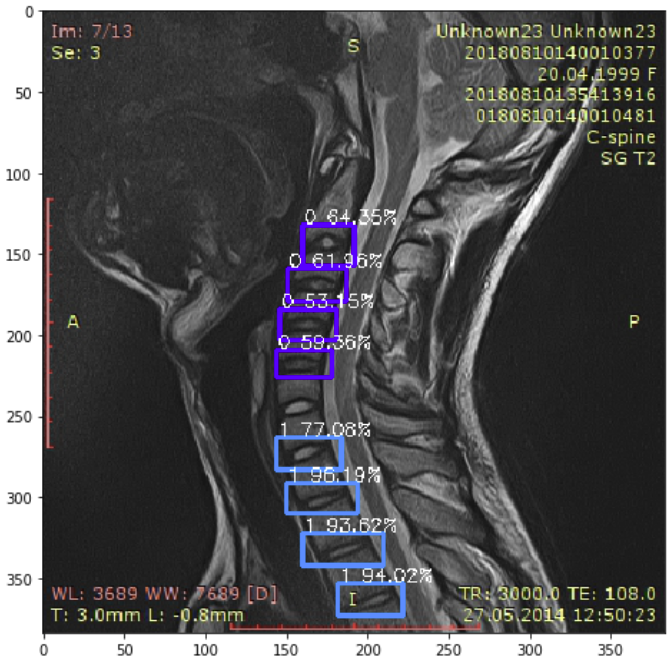
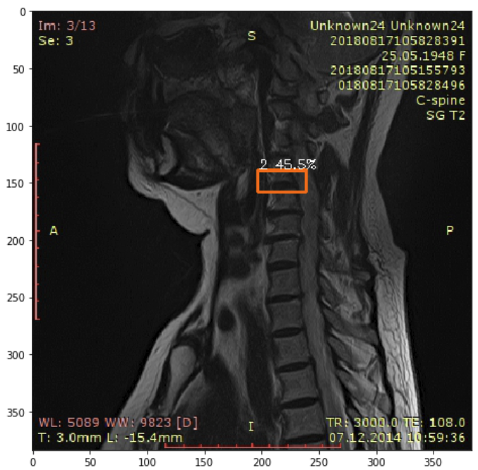

## Mri spine detection
Test task for **Care Mentor AI**. Detection of intervertebral disc pathologies on mri spine.
## Using
- preprocessing.py - data capturing, train-val-test splitting, converting to voc format.
From data selected only "Visualized (you can mark)". Dropped rows with rare classes (only 2). Train-val-test split based on the most rare label on image - greater index mean more rare label. 
- Data_vis.ipynb - notebook with data visualization. Refactored to only few clean cells. Some EDA of input data parameters.
- train.py - training script. Use: ```python train.py -c config.json```. cofig.json - all training parameters, paths to data, weights, logs.
- evaluate.py - eval metric script. Use: ```python evaluate.py -c config.json``` Compute map metric for each class on validation data.
- Prediction_vis.ipynb - notebook with prediction on test data with fitted model. Saving result 
on disk (image with predicted bounding boxes).
## Result
Yolo v3 model was trained on this data. Loss plot:


Result of working model on test data:



Some times it fails:


Metric on this test set for each class(bug):

0: 0.0697

1: 0.1310

2: 0.0026

3: 0.0000

4: 0.0000

5: 0.0000

mAP: 0.0339

There is some bug in calculating metrics.

## Future work
- Fix calculating metric bug.
- Look at data annotation, m.b. there are some useful attributes.
- Add more data augmentation.
- Do oversampling of smaller classes.
- Make predict loop in different script.

## References
- https://github.com/experiencor/keras-yolo3 - yolo v3 model training